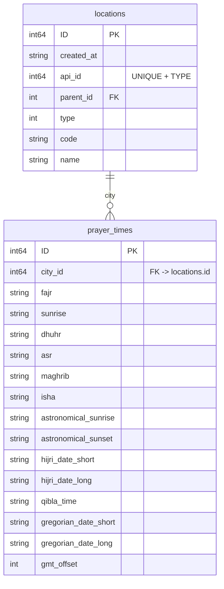

# Ezan Vakti (Prayer Times) Projesi

Bu proje, Diyanet İşleri Başkanlığı'nın resmi ***Awqat Salah*** REST API'sini kullanarak dünya genelindeki ülke → eyalet/il → şehir/ilçe hiyerarşisini ve bu şehirlerin namaz vakitlerini (günlük, haftalık, aylık, yıllık, Ramazan, bayram vb.) periyodik olarak indirir ve yerel bir PostgreSQL veritabanına kaydeder.

> **Hedef:** Veritabanına indirilen verilerin daha sonra başka servisler/uygulamalar tarafından kolayca tüketilebilmesi için tek kaynak (**single-source**) hâline getirilmesi.

---

## İçindekiler

- [Teknolojiler](#teknolojiler)
- [Mimari](#mimari)
- [Kurulum](#kurulum)
  - [Önkoşullar](#önkoşullar)
  - [Env Değişkenleri](#env-değişkenleri)
  - [Uygulamayı Çalıştırma](#uygulamayı-çalıştırma)
- [Veritabanı Şeması](#veritabanı-şeması)
- [Veri Senkronizasyon Akışı](#veri-senkronizasyon-akışı)
- [Katkıda Bulunma](#katkıda-bulunma)
- [Lisans](#lisans)

---

## Teknolojiler

| Teknoloji  | Kullanım Amacı                                   |
|------------|---------------------------------------------------|
| **Go**     | Ana programlama dili                              |
| **Bun ORM**| PostgreSQL erişimi ve şema yönetimi               |
| **PostgreSQL** | Kalıcı veri saklama                           |
| **Viper**  | Konfigürasyon yönetimi (env + varsayılanlar)      |
| **godotenv** | `.env` dosyasından değişken okuma (opsiyonel)   |
| **Awqatsalah REST API** | Veri kaynağı                          |

> Proje Go **1.23** ile test edilmiştir. Farklı sürümlerde derleme hataları yaşayabilirsiniz.

---

## Mimari

```
┌────────────────────┐   1. Auth/Login   ┌────────────────────┐
│  api/clients       ├───────────────►   │  Diyanet API       │
│  (HTTP katmanı)    │                  │  (awqatsalah)      │
└────────┬───────────┘                  └────────┬───────────┘
         │ 2. /Place/* , /PrayerTime/*           │
┌────────▼───────────┐                          │
│ common/service     │  ←──── JSON              │
│ İş kuralları       │                          │
└────────┬───────────┘                          │
         │ bun.DB (SQL)        3. INSERT        │
┌────────▼───────────┐                          │
│ PostgreSQL         │                          │
│ (locations,        │                          │
│  prayer_times)     │                          │
└────────────────────┘                          │
```

- **api/clients**: API endpoint çağrılarını yapan düşük seviyeli HTTP katmanı.
- **common/service**: İş mantığı. Verileri çekip dönüştürür, veritabanına yazar.
- **pkg**: Ortak yardımcı paketler (config, database init, migration).
- **api/cmd**: Çalıştırılabilir uygulama (`main.go`). Burada periyodik senkronizasyon tetiklenir.

---

## Kurulum

### Önkoşullar

- Go 1.23+
- Çalışan bir PostgreSQL sunucusu (varsayılan: `localhost:5432`).

### Env Değişkenleri

Uygulama Viper ile aşağıdaki değişkenleri okur. `.env` dosyası oluşturabilir veya kabuk ortamınıza export edebilirsiniz:

| Değişken            | Açıklama                                | Varsayılan |
|---------------------|-----------------------------------------|------------|
| `API_BASE_URL`      | Diyanet API ana URL'i                  | `https://awqatsalah.diyanet.gov.tr` |
| `API_EMAIL`         | Giriş için e-posta                      | demodaki örnek |
| `API_PASSWORD`      | Giriş şifresi                           | demodaki örnek |
| `DB_HOST`           | PostgreSQL host                         | `localhost` |
| `DB_PORT`           | PostgreSQL port                         | `5432` |
| `DB_NAME`           | Veritabanı adı                          | `ezanvakti` |
| `DB_USERNAME`       | Veritabanı kullanıcı adı                | `burakalemdar` |
| `DB_PASSWORD`       | Veritabanı parolası                     | `burakalemdar` |
| `DB_SSLMODE`        | `disable`, `require`, vs.               | `disable` |
| `UPDATE_PERIOD`     | Senkronizasyon periyodu (saat, gün vb.) | `696h` (≈29 gün) |

### Uygulamayı Çalıştırma

1. Depoyu klonlayın:
   ```bash
   git clone https://github.com/hayrat/ezan-vakti.git && cd ezan-vakti
   ```
2. Bağımlılıkları indirin:
   ```bash
   go mod tidy
   ```
3. Veritabanını oluşturun (PG tarafında):
   ```bash
   createdb ezanvakti  # veya başka bir isim
   ```
4. Ortam değişkenlerinizi ayarlayın (örnek linux/macOS):
   ```bash
   export DB_USERNAME=postgres
   export DB_PASSWORD=postgres
   # ... diğerleri
   ```
5. Uygulamayı başlatın:
   ```bash
   # Çalıştırılabilir dizin api/cmd'dir
   go run ./api/cmd
   ```

Uygulama başlatıldığında:

- İlk olarak tablo migrasyonu yapar (mevcut tablo varsa SİLİP tekrar oluşturur!)
- Ardından tüm ülke→eyalet→şehir hiyerarşisini ve aylık namaz vakitlerini indirir.
- `UPDATE_PERIOD` süresi doldukça aynı işlemi tekrarlayan bir ticker devreye girer.

> **Not:** Eğer tablolarınızı korumak istiyorsanız `pkg.Migrate()` fonksiyonunu revize ederek *drop* adımını kaldırabilirsiniz.

---

## Veritabanı Şeması



---

## Veri Senkronizasyon Akışı

1. **Authenticate** → `/Auth/Login` ile Access-Token alınır.
2. **Locations** → Ülkeler, her ülke için eyaletler, her eyalet için şehirler isteğe bağlı ardışık çağrılarla çekilir.
3. **Bulk Insert** → `common/service.PlaceService.SaveLocationsToDB` aynı kayıt varsa `ON CONFLICT` ile günceller.
4. **Prayer Times** → Her şehir için `/PrayerTime/Monthly/{cityId}` çağrılır ve sonuçlar `prayer_times` tablosuna eklenir.
5. Tüm işlemler bittiğinde bir sonraki döngüye kadar beklenir.

---

## Katkıda Bulunma

Pull-request'lere ve issue'lara açıktır. Lütfen büyük değişiklikler öncesinde **issue** açıp tartışalım.

1. Fork ➜ Clone ➜ Branch (`git checkout -b feature/foo`)
2. Değişiklik yap & test et
3. `go vet ./... && go test ./...` çıktılarının temiz olduğundan emin ol
4. PR gönder ✨

---